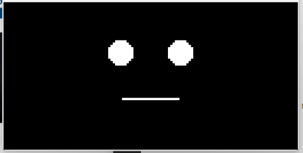
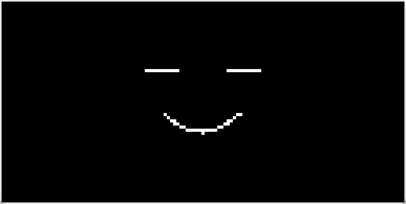
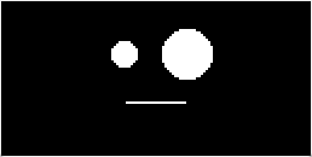
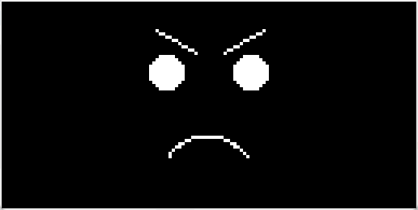
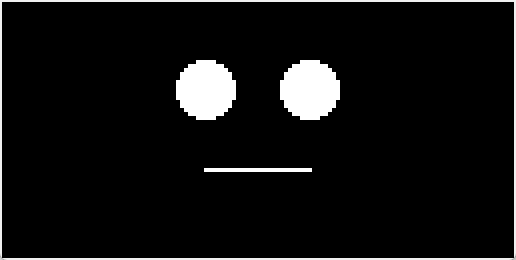
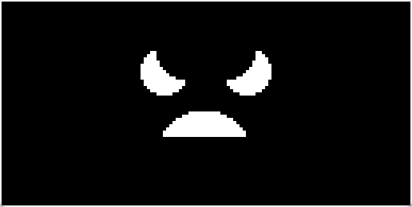
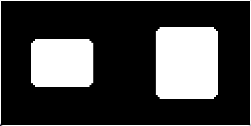
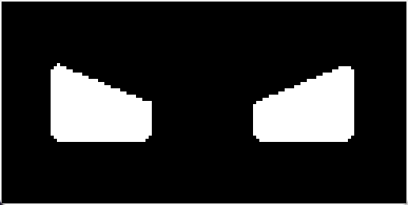

# Python Roboface

Simple Python library for drawing roboface on OLED display (SSD1306) connected to LuckFox Pico or any other Linux DevBoard with buildroot without any additional dependencies.

As is well known, using buildroot images on modern Linux DevBoards complicates development due to the need to rebuild the image to include external libraries. I decided to try writing a buildroot library from scratch that doesn't require any additional dependencies.

The result is a small library that simply needs to be copied into the DevBoard file system.

## Library use

Just copy libs folder to your DevBoard FS and import RoboFace and SSD1306.

For example you can see main.py or just run it.

## Roadmap

- [x] Add eyelids for more realistic winking
- [x] Add more face styles and style switch
  - [x] Style switching
  - [x] RoboRound
  - [x] RoboQuad (big square eyes)

## Preview

| Style     |                    Neutral                     |                                        Smile | Happy                                        | Shocked                                        | Angry                                        |
| :-------- | :--------------------------------------------: | -------------------------------------------: | -------------------------------------------- | ---------------------------------------------- | -------------------------------------------- |
| Smile     |       |       |       |       |       |
| RoboRound |  |  |  |  |  |
| RoboQuad  |   |   |   |   |   |

## Support project

If you like this project, please support it by star it or you can me a coffee. The details are in the profile.
